<h1 align=center> OpenSSL Report <h1>
  
# Table of contents
  
1. [OpenSSL installation](#installation)
2. [Performance of OpenSSL](#performance)
3. [Using OpenSSL from commandline interface](#cmd)
4. [Exchange of encrypted data](#exchanged)

## 1. OpenSSL installation 
  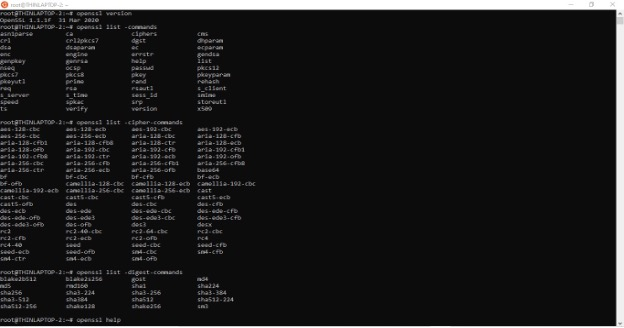
  
  
 In this project, I used Linux system Ubuntu flavor to test encryption and decryption.

  ### a. Start the OpenSSL command line
  
  <ul>
    <li><i>openssl version</i> = to check whether the openssl is installed on my system or not.</li>
  </ul>
  

  ### b. List commands by type 
   <ul>
     <li><i>openssl list -command</i> = shows the list of commands</li>
     <li><i>openssl list -cipher-commands</i> = to see the list of built-in cipher algorithm commands with different modes and bits to encrypt and decrypt data.</li>
     <li><i>openssl list -digest -commands</i> = shows a list of available digest algorithms to process the message.</li>
  </ul>
    
    
  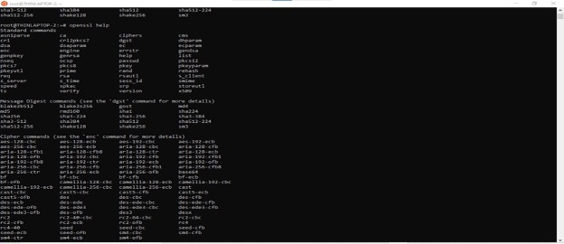

   ### c. Use the help to find out more about OpenSSL
   <ul>
     <li><i>openssl help</i> = command shows the help menus.</li>
   </ul>
   
   
## 2. Performance of OpenSSL 
  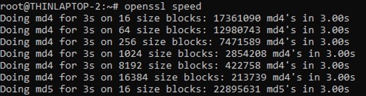
  
  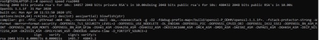
  
  ### a. Make a speed test on the PC-platform with the speed command. 
  
The output of the speed command line means run the md4 hash routine in a loop for 3 seconds with a 16-byte input. After 3 seconds, observe that we ran just a bit over 17 million iterations. That's about 51 million bytes processed. This shows the speed of RSA 2048bits encryption per second and decryption per second on my PC.

  
  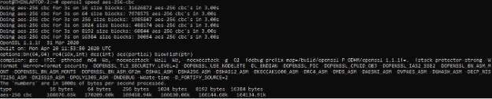
  
  ### b. Compare the results for symmetric encryption, AES-CBC, and RSA signature.
  
 This shows the speed of AES 256 bits in CBC mode. As we know, AES is a symmetric block cipher which is faster and RSA is an asymmetric cryptosystem. That’s why RSA is a bit slower than AES.
  

 
## 3. Using OpenSSL from commandline interface
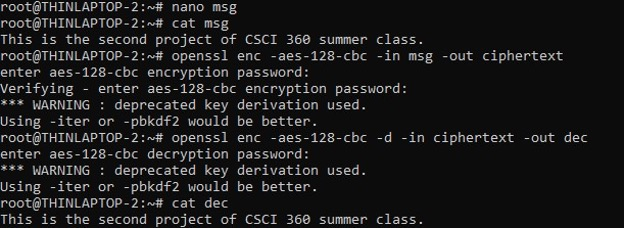

 ### a. Create a text file with some input and encrypt it using. 
 
 i. AES-128 CBC
  
First I created a message in nano pad to encrypt and decrypt.

    <ul>
      <li>nano msg = to open the nano pad to write message</li>
      <li>cat msg = display the content of msg file</li>
    </ul>
      
Then set the password for AES encryption and the same password will be used for decryption.
    <ul>
      <li>openssl enc -aes-128-cbc -in msg = encrypt the message using 256 bit AES encryption and CBC mode and define the input file which is msg</li>
      <li>openssl enc -aes-128-cbc -in msg -out enc = The ciphertext was generated and store the output file called enc</li>
    </ul>
 

 
 
 ii. AES-256 CTR 

 
 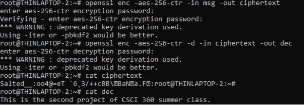
 
 
 iii. DES 

 
 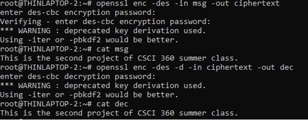
 
AES and DES is a symmetric block cipher which means it uses the same key to encrypt and decrypt data as we did above. In the next task, we are going to use the RSA algorithm to do encryption and decryption.

### b. creating a 2048 bit RSA public and private key

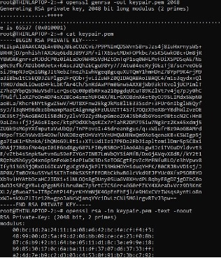

<ul>
  <li>Openssl genrsa -out keypair.pem 2048 = generate private and public key which is 2048 bit long by using RSA and store the keys in keypair.pem</li>
</ul>

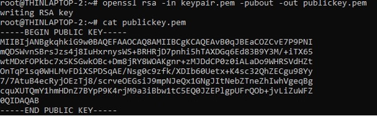

Then, we separate the public key from the keypair.pem and store it in publickey.pem.This public key has to be sent to the other user to encrypt the message.

## 4. Exchange of encrypted data 
### a. Encrypt a file (e.g., a text file) with an algorithm and a key length of your choice.

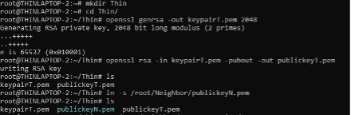

In this task, I am going to decrypt my neighbor's secret message using the RSA algorithm.	

First open two windows of the linux terminal and create folder Neighbor on one terminal and folder Thin on the other one. Then, change the directory to the designated folder. Then, both users generate public and private key.

<ul>
  <li>Openssl genrsa -out keypairN.pem 2048 = generate private and public key which is 2048 bit long by using RSA and store the keys in keypairN.pem</li>
</ul>

Public key has to be stored in a separate file and shared with others, so that he/she can encrypt the message using the public key. 

<ul>
  <li>Openssl rsa -in keypairN.pem -pubout -out publicN.pem = operate RSA and store only public key from keypairN.pem to publicN.pem</li>
</ul>

### b. Exchange the file and the necessary credentials for decryption (i.e., algorithm, key) with your neighbor 
Since both neighbors and I  have our own private and public keys, we are going to exchange our  public keys.

<ul>
  <li>Ln -s /root/Thin/publickeyT.pem = Neighbor link the source of publickeyT.pem file of Thin</li>
</ul>

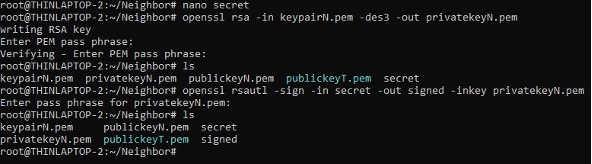

Neighbor created a secret message, “I don’t know how to bake cookies” and stored it in a secret file. In an asymmetric algorithm, not only encryption and decryption but also need to sign and verify signatures in files. Since it is not a good practice to sign the message using a private key directly, encrypt the private key with password and sign the message using that private key. 

<ul>
  <li>Openssl rsa -in keypairN.pem -des3 -out privatekeyN.pem = Neighbor separate the private key from keypairN.pem and store it in privatekeyN.pem using RSA DES3 encryption.</li>
  <li>Openssl rsautl -sign -in secret -out signed -inkey privatekeyN.pem =  neighbor sign the secret message using privatekeyN.pem and stored in a singed file.</li>
  
  
  
  <li>cp /root/Neighbor/signed signed = copy signed from Neighbor and store in another file called signed.</li>
</ul>

### c. Decrypt the secret of your neighbor. 
Now I am going to decrypt my neighbor's secret. First, I am going to verify whether the signed file belongs to my neighbor using the public he gave me.

<ul>
  <li>Openssl rsautl -verify -in signed -out singedFile -inkey publickeyN.pe -pubin = verify the signed file using publickeyN.pem and stored in signedFile </li>
</ul>

Once it was verified, I got my neighbor's secret “I don’t know how to bake cookies”. 

